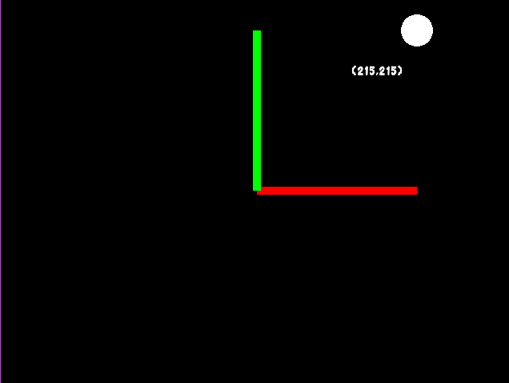

# display
Класс доступный в глобальном пространстве любой сцены, используется для создания объектов и управления отображением.
## Примечание о позиционировании
В Override все объекты имеют начальную позицию x = 0, y = 0 ровно по центру экрана, Y математический.

Методы:
## display:rect(number x, number y,number width,number height) -> GameObject/Rect
Создаёт и возвращает прямоугольник для управления.
```lua
local a = display:rect(0,0,100,100)
```
## display:circle(number x, number y,number radius) -> GameObject/Circle
Создаёт и возвращает круг для управления.
```lua
local a = display:circle(0,0,100)
```
## display:image(string pathToImage ,number x, number y,number width,number height) -> GameObject/Image
Создаёт и возвращает изображение для управления.
```lua
local a = display:image("image.png",0,0,100,100)
```
## display:text(string text,number x, number y,string pathToFont, int fontSize) -> GameObject/Text
Создаёт и возвращает текст для управления.
```lua
local a = display:text("text",0,0,"raleway.ttf",30)
```