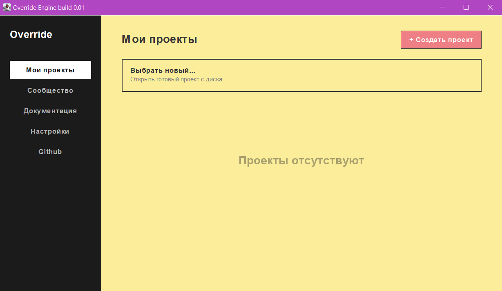

# Добро пожаловать в Override!

Override - игровой фреймворк использующий для написания логики простой и лёгкий Lua 5.2.

Главными принципами фреймворка являются: простота, удобность, скорость и доступность. Мы стремимся сделать доброжелательное комьюнити и обеспечить наилучший опыт в разработке игр. Фреймворк находится в активной разработке, не забывайте обновлять его и по возможности сообщать ошибки самого фреймворка, нам это сильно поможет ^_^.

## Начало работы
Для того чтобы начать создавать на оверрайд вам нужно несколько вещей: сам фреймворк и редактор кода(`VS code`, `Sublime text`, `notepad++`). Скачать фреймворк можно на нашей странице itch.io, после скачивания запустите исполняемый файл .exe, вы увидите такое окно:
Как вы могли заметить в правом верхнем углу есть кнопка "Новый проект" при нажатии на которую вас попросят выбрать директорию для проекта а затем имя. После этих действий у вас откроется новое чёрное окно, не стоит пугаться, это и есть ваш холст. Давайте для теста создадим что нибудь, откройте файл `main.lua` который автоматически появился в папке с вашим только что созданным проектом и напишите туда: 
```lua
local myCircle = display:circle(0,0,50)
```
Должен получиться вот такой результат:


## Быстрый старт
Перейдите в раздел графики, чтобы узнать, как рисовать объекты.

## Транзакции
Override имеет платную и бесплатную версии, отличий между ними нет, платная версия создана для того чтобы поддержать нашу разработку.
